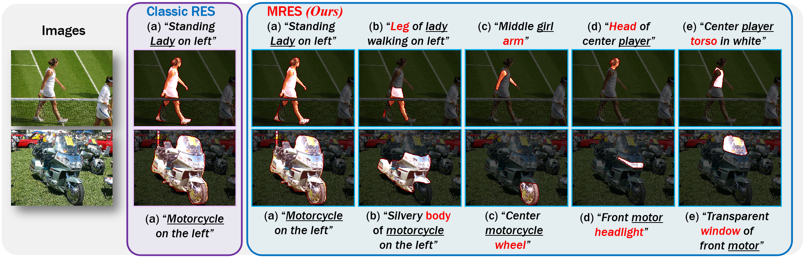
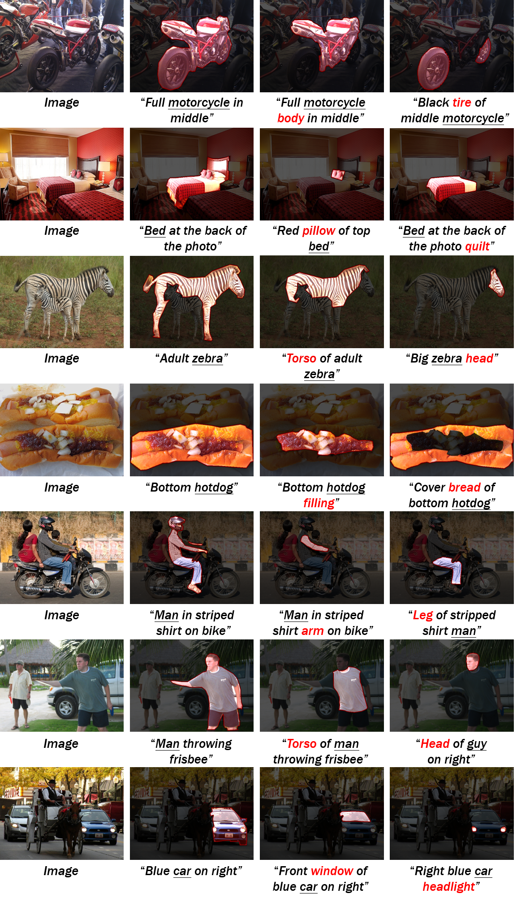
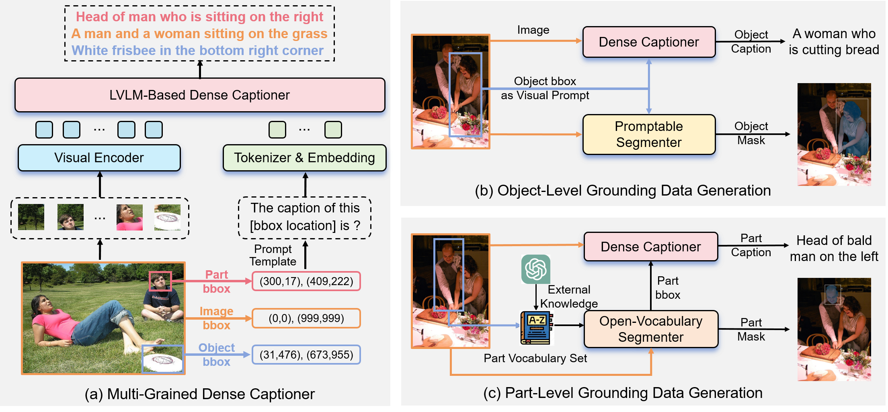
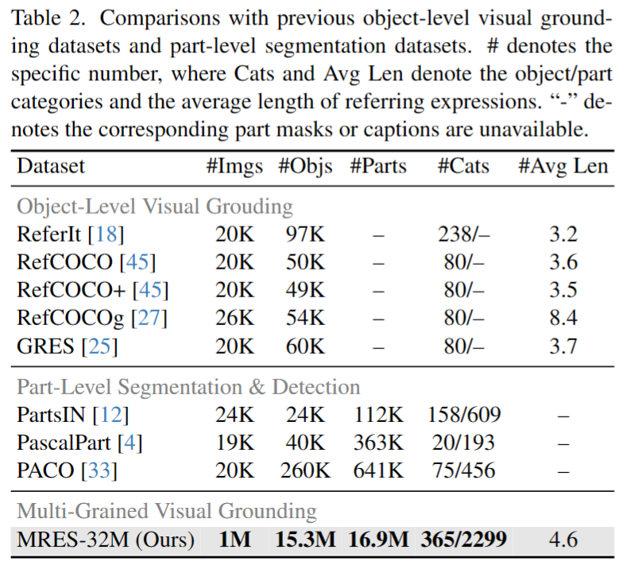
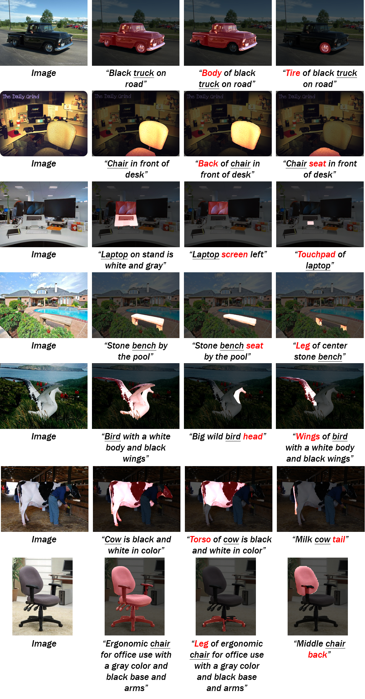
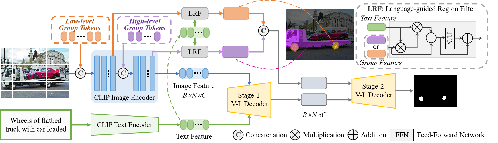
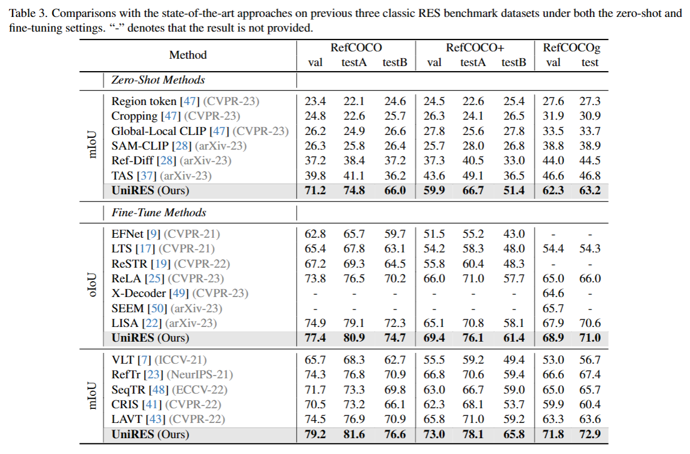
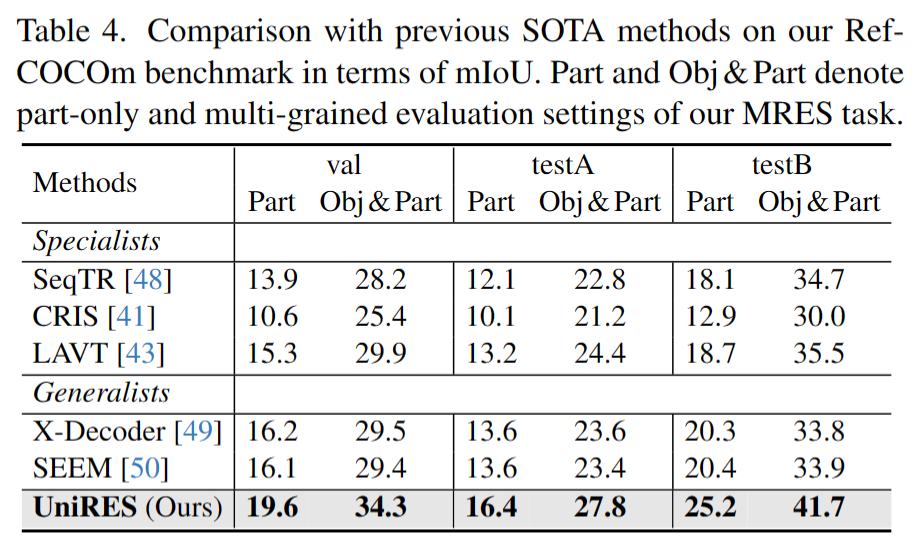

# Unveiling Parts Beyond Objects: Towards Finer-Granularity Referring Expression Segmentation
Wenxuan Wang, Tongtian Yue, Yisi Zhang, Longteng Guo, Xingjian He, Xinlong Wang, Jing Liu

The repository contains the official code and data of our paper "Unveiling Parts Beyond Objects: Towards Finer-Granularity Referring Expression Segmentation".

<a href='https://arxiv.org/abs/2312.08007'></a>   [Paper](https://arxiv.org/abs/2312.08007)


## 🌕 Abstract
Referring expression segmentation (RES) aims at segmenting the foreground masks of the entities that match the descriptive natural language expression. Previous datasets and methods for classic RES task heavily rely on the prior assumption that one expression must refer to object-level targets. In this paper, we take a step further to finer-grained part-level RES task. To promote the object-level RES task towards finer-grained vision-language understanding, we put forward a new multi-granularity referring expression segmentation (MRES) task and construct an evaluation benchmark called RefCOCOm by manual annotations. By employing our automatic model-assisted data engine, we build the largest visual grounding dataset namely MRES-32M, which comprises over 32.2M high-quality masks and captions on the provided 1M images. Besides, a simple yet strong model named UniRES is designed to accomplish the unified object-level and part-level grounding task. Extensive experiments on our RefCOCOm for MRES and three datasets (\ie, RefCOCO(+/g)) for classic RES task demonstrate the superiority of our method over previous state-of-the-art methods.
<p align="center">
 
</p>

---
## 🌖 Benchmark RefCOCOm
The newly bulit benchmark RefCOCOm can be found at [here](https://drive.google.com/file/d/1Qzt4cxyexe0xspsH_2oexylOKBI4Jim_/view?usp=drive_link). We follow the same specific data processing details as [CRIS](https://github.com/DerrickWang005/CRIS.pytorch), which can be found at [here](https://github.com/DerrickWang005/CRIS.pytorch/blob/master/tools/prepare_datasets.md).
<p align="center">
 
</p>

## 🌗 Data Generation Engine & Training Set MRES-32M
<p align="center">
 
</p>
<p align="center">
 
</p>
<p align="center">
 
</p>

## 🌘 Simple Baseline Model UniRES
<p align="center">
 
</p>

## 🌑 Results
<p align="center">
 
</p>
<p align="center">
 
</p>

## 🚀 Citation
If you use our data or model in your work or find it is helpful, please cite the corresponding paper:

```
@article{wang2023unveiling,
  title={Unveiling Parts Beyond Objects: Towards Finer-Granularity Referring Expression Segmentation},
  author={Wang, Wenxuan and Yue, Tongtian and Zhang, Yisi and Guo, Longteng and He, Xingjian and Wang, Xinlong and Liu, Jing},
  journal={arXiv preprint arXiv:2312.08007},
  year={2023}
}
```

## 🏭 Reference
1.[CRIS](https://github.com/DerrickWang005/CRIS.pytorch)
